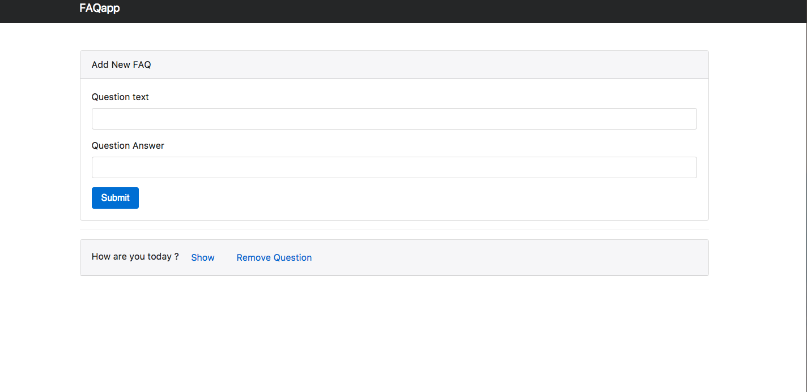
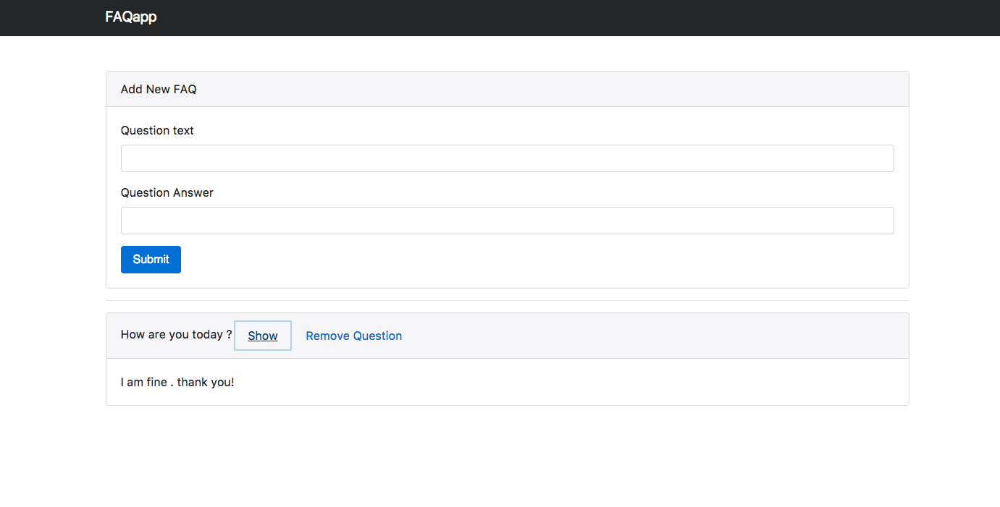

# Faqapp

This project was generated with [Angular CLI](https://github.com/angular/angular-cli) version 1.2.0.

### Development server

Run `ng serve` for a dev server. Navigate to `http://localhost:4200/`. The app will automatically reload if you change any of the source files.

### Project summary
* A very basic FAQ app created with Angular 4
* The data is stored in Local Storage
* The project is structured in numerous components for keeping the code clean and easy to follow  
* Version control used: Git

### Project functionality

#### You can add a question and an answer

#### The questions are displayed on the page even after you refresh it because the data is stored in Local Storage. Pressing the 'Show' link will display the answer.You can delete the question by pressing the "Remove question" link

### Further help

To get more help on the Angular CLI use `ng help` or go check out the [Angular CLI README](https://github.com/angular/angular-cli/blob/master/README.md).
